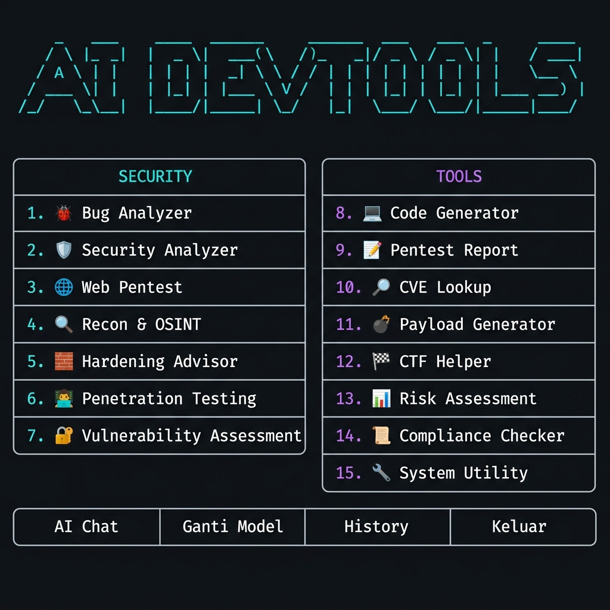
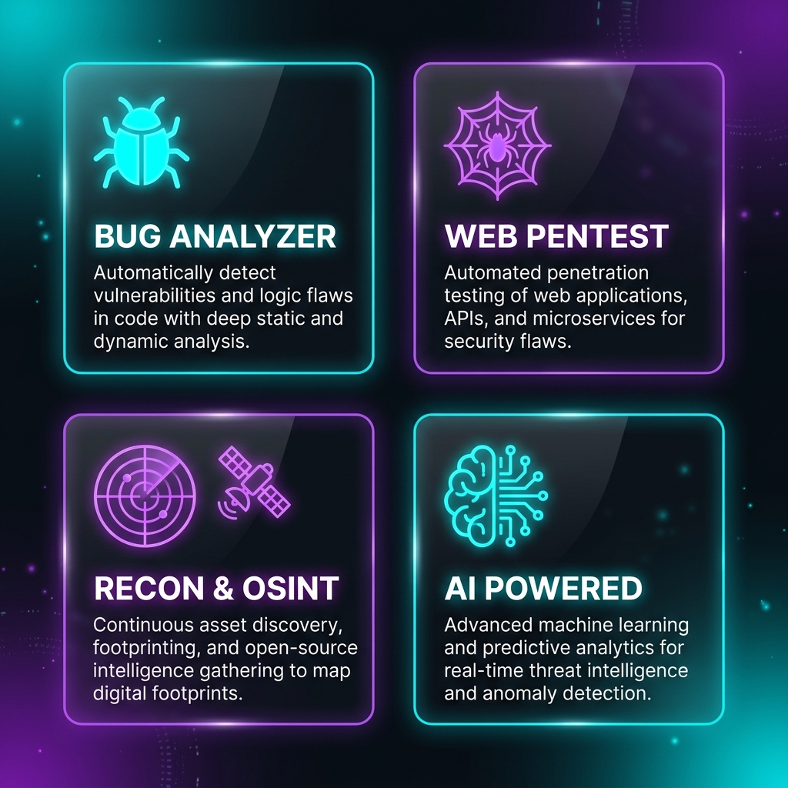

# 🛡️ CyberSecurity Agent — AI DevTools

<div align="center">


**AI-powered cybersecurity & development toolkit yang berjalan di terminal.**  
Memiliki akses ke puluhan model AI terbaik — **gratis maupun berbayar.**

</div>

---

## ✨ Fitur Utama



CyberSecurity Agent memiliki **18 mode analisis** yang terbagi dalam 3 kategori:



### 🔒 Security
| No | Mode | Deskripsi |
|----|------|-----------|
| 1 | 🐛 **Bug Analyzer** | Deteksi bug, error, dan masalah kualitas kode |
| 2 | 🔐 **Security Analyzer** | Audit keamanan kode / sistem (OWASP Top 10) |
| 3 | 🌐 **Web Pentest** | Analisis kerentanan & attack surface website |
| 4 | 📡 **Recon & OSINT** | Gather intelligence: subdomain, teknologi, Google Dorks |
| 5 | 🛡️ **Hardening Advisor** | Panduan hardening Nginx, Docker, Firebase, dll |
| 6 | 🔍 **Code Diff Review** | Review `git diff` untuk bug & security issue baru |
| 7 | 🤖 **Malware Analyzer** | Deteksi malicious pattern & kode berbahaya |

### ⚡ Tools
| No | Mode | Deskripsi |
|----|------|-----------|
| 8  | 💻 **Code Generator** | Buat program production-ready dari deskripsi |
| 9  | 📝 **Pentest Report** | Generate laporan pentest profesional |
| 10 | 📋 **CVE Lookup** | Cari CVE & exploit untuk teknologi/versi tertentu |
| 11 | 💬 **Payload Generator** | SQLi, XSS, CSRF, LFI, Command Injection payloads |
| 12 | 🔐 **Hash & Crypto** | Identifikasi hash, analisis kelemahan enkripsi |
| 13 | 🗂️ **Log Analyzer** | Deteksi serangan & anomali dari log server |
| 14 | 📱 **Mobile Security** | Analisis keamanan Android/iOS (OWASP Mobile Top 10) |
| 15 | 🏆 **CTF Helper** | Solve Capture The Flag challenges |

### ⚙️ General
| No | Mode | Deskripsi |
|----|------|-----------|
| 16 | 💬 **AI Chat** | Tanya apa saja ke AI secara interaktif |
| 17 | 🔄 **Ganti Model** | Switch antara 9 model AI |
| 18 | 📁 **History** | Lihat & buka hasil analisis yang tersimpan |

---

## 🚀 Instalasi

### Prasyarat
- Python **3.8+**
- AI API Key yang valid

### Langkah Instalasi

```bash
# 1. Clone repository
git clone https://github.com/Asoyydeh/CyberSecurityAgent.git
cd CyberSecurityAgent

# 2. Install dependencies
pip install -r requirements.txt

# 3. Setup API Key
cp .env.example .env
# Edit .env dan isi AI_API_KEY dengan key Anda

# 4. Jalankan
python -X utf8 main.py
```

### Windows (mudah)
```batch
# Double-click file:
run.bat
```

---

## ⚙️ Konfigurasi

Buat file `.env` di root project:

```env
# Masukkan API Key Anda di sini
AI_API_KEY=sk-or-v1-your_api_key_here
```

---

## 🤖 Model AI yang Didukung

| Model | Kelebihan |
|-------|-----------|
| `gemma` | Default, cepat & akurat |
| `gpt` | Sangat capable |
| `nemotron` | parameter |
| `nemotron` | Reasoning khusus |
| `gpt` | Ringan & cepat |
| `nemotron` | Balanced |
| `nemotron` | Super cepat |
| `gemini` | Best overall |
| `claude` | Terbaik untuk kode & analisis |

> 💡 **Auto-fallback**: Jika satu model rate-limited, sistem otomatis pindah ke model lain tanpa restart.

---

## 📖 Cara Penggunaan

### Menjalankan Aplikasi
```bash
python -X utf8 main.py
```

### Contoh Penggunaan

#### 🐛 Bug Analyzer
```
Pilih menu: 1
Bahasa pemrograman: python
📋 Paste kode → [paste kode Anda] → Enter 2x
```

#### 🌐 Web Pentest
```
Pilih menu: 3
🌐 URL target: https://target.com
📋 Info tambahan: WordPress 5.8, PHP 7.4
```

#### 📋 CVE Lookup
```
Pilih menu: 10
🛠️ Teknologi: Apache
📌 Versi: 2.4.49
```

#### 💬 Payload Generator
```
Pilih menu: 11
Pilih tipe: 1 (SQL Injection)
Konteks: MySQL, login form
```

### Menyimpan Hasil
Setelah setiap analisis, Anda akan ditanya:
```
💾 Simpan hasil ke file? [Y/n]
```
Hasil disimpan otomatis di folder `history/` dalam format Markdown.

---

## 🗂️ Struktur Project

```
CyberSecurityAgent/
├── main.py           # Aplikasi utama & UI (18 menu)
├── client.py         # API client (streaming + auto-fallback)
├── analyzers.py      # System prompts untuk 16 mode AI
├── config.py         # Konfigurasi & daftar model
├── requirements.txt  # Dependencies Python
├── run.bat           # Launcher Windows (double-click)
├── .env.example      # Template konfigurasi API key
└── history/          # Hasil analisis tersimpan (auto-generated)
    ├── web_pentest_20260527_022807.md
    ├── bug_analysis_20260527_*.md
    └── ...
```

---

## 🛠️ Dependencies

```txt
rich>=13.0.0      # Beautiful terminal UI
requests>=2.31.0  # HTTP client
```

Install:
```bash
pip install -r requirements.txt
```

---

## ⚠️ Disclaimer

> **PENTING:** Tool ini dibuat untuk tujuan **edukasi dan pengujian keamanan yang sah**.
>
> - Hanya gunakan pada sistem yang **Anda miliki** atau **telah mendapat izin** untuk diuji
> - Penggunaan untuk menyerang sistem orang lain **adalah ILEGAL** dan melanggar hukum
> - Penulis tidak bertanggung jawab atas penyalahgunaan tool ini

---

## 🔐 Keamanan

- **API key tidak pernah di-hardcode** — selalu dibaca dari environment variable / `.env`
- File `.env` masuk `.gitignore` secara default
- Data dikirim hanya ke API endpoint yang terkonfigurasi

---

## 🤝 Kontribusi

1. Fork repository ini
2. Buat branch fitur: `git checkout -b fitur/nama-fitur`
3. Commit perubahan: `git commit -m "Tambah: nama fitur"`
4. Push branch: `git push origin fitur/nama-fitur`
5. Buat Pull Request

---

## 📄 Lisensi

Proyek ini dilisensikan di bawah [MIT License](LICENSE).

---

<div align="center">

**Dibuat dengan ❤️ | AI DevTools**

⭐ Jika berguna, berikan Star di GitHub!

</div>
